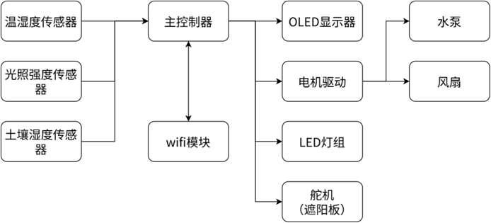

# intp_IntelligentPlant🪴🪴🪴

  

## 基于stm32的智能植物养殖系统

本设计旨在实现一套基于单片机的智能植物养护系统，实现对特定植物养护流程的精细化控制。具体研究内容如下：
1.	硬件系统构建： 完成以单片机为核心的电路设计，集成温湿度、土壤湿度、光照传感器，配置Led补光灯，舵机，水泵等执行机构。
2.	软件控制逻辑： 编写数据采集与处理程序，实现基于预设阈值的全自动浇水与补光控制逻辑，开发按键交互功能。开发上位机应用和用户界面，实现数据的可视化以及阈值参数可调。接入大模型API，实现对于特定植物的阈值智能设定和为用户提供养护参考。
3.	系统联调与验证： 搭建模拟环境，测试系统对特定植物的养护效果（如保持土壤湿度稳定、定时补光），验证系统的运行稳定性。

## 总体方案
根据系统功能需求，可以将系统总体架构分为感知层、控制层、执行层、交互层四个层级。根据检测到的数据，系统可自动判断是否进行浇水、降温排风、加热、遮光以及补光照射。系统总体设计框图如图所示：

1.	感知层：分别选用土壤湿度传感器、SHT30温湿度传感器和MH Sensor Series光敏传感器来检测土壤湿度、温湿度和光照强度。
2.	控制层： 选用意法半导体（ST）的STM32最小子系统（STM32F103C8T6）作为主控。
3.	执行层：配置sg90舵机用于控制遮阳棚，LED补光灯用于补光；潜水泵用于浇灌；风扇用于除湿与降温。
4.	交互层：0.9寸OLED显示屏用于数据显示，配置按键用于参数设置，LED小彩灯报警或指示。Wi-Fi模块用于上位机通信，在上位机显示数据并设置控制阈值。

## 嵌入式软件总体方案

在Keil开发环境下进行编程，编写各传感器模块的驱动程序，实现数据稳定采集。设计系统主控程序，包括数据的初步的处理、针对养护特定的植物的目的，设置基于阈值的智能判断逻辑（自动浇水、补光、控温）。设计上位机的通讯程序，调用Wi-Fi模块实现传感器数据和阈值数据的收发。

## 上位机软件总体方案

结合WebSocket与本地TCP桥接服务实现与下位机的数据通信。
开发web应用，实现和下位机收发数据，开发用户界面和图表，实现数据的可视化。接入大语言模型的API生成特定植物的养护建议和建议阈值。

## 系统集成与测试

进行软硬件的联合调试，对系统的各项功能、稳定性、可靠性及控制精度进行测试与优化。
